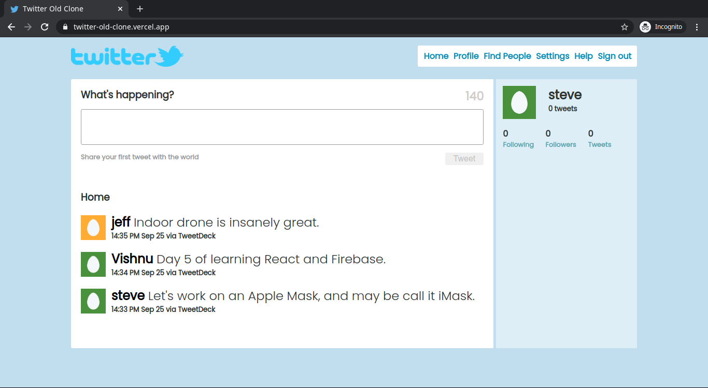

## Twitter Old Clone

Twitter Clone built using React as Front End & Firebase as Back End. The UI is inspired by the look of 2010s.

Project is hosted on vercel - https://twitter-old-clone.vercel.app/

## Features

User can register for an account and sign in using email, password authentication and can create tweets and see tweets by other users in real time.

Project uses - 

- Firebase Authentication
- Firebase Firestore Database

### Run Project Locally

Clone the project repository and do npm install in the project directory to install the needed dependencies.

Runs the app in the development mode, by running the command - npm start 
Open [http://localhost:3000](http://localhost:3000) to view it in the browser.

You also need to create a Firebase account and a file named .env.local in your project folder.
And copy paste the Firebase configuration to your .env.local file. (Remember to append your config variables with the keyword REACT_APP)
